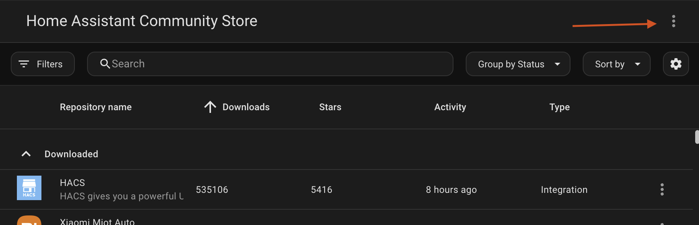
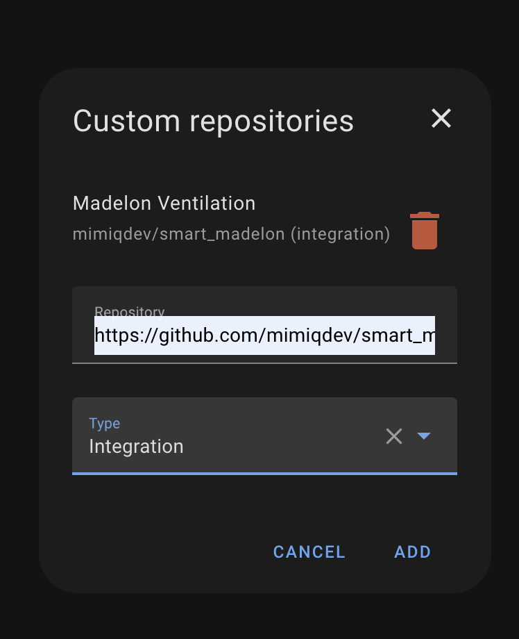
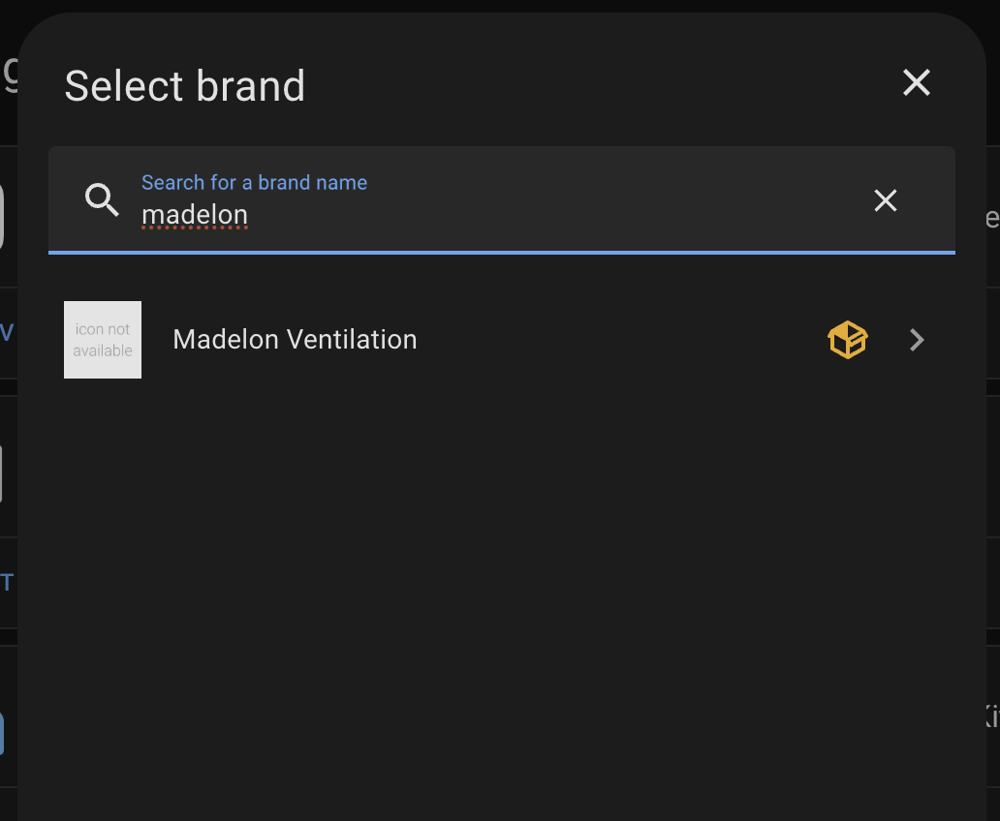
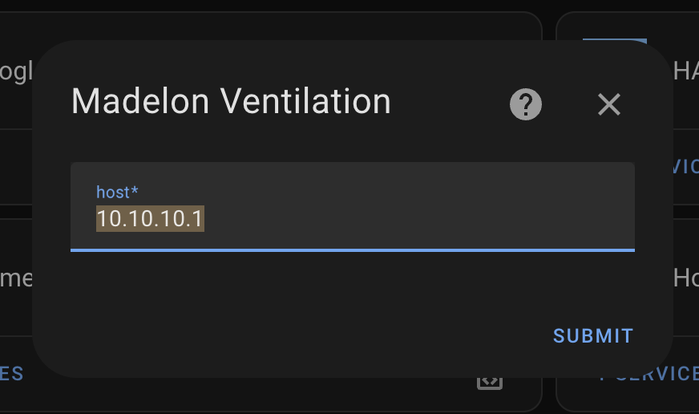
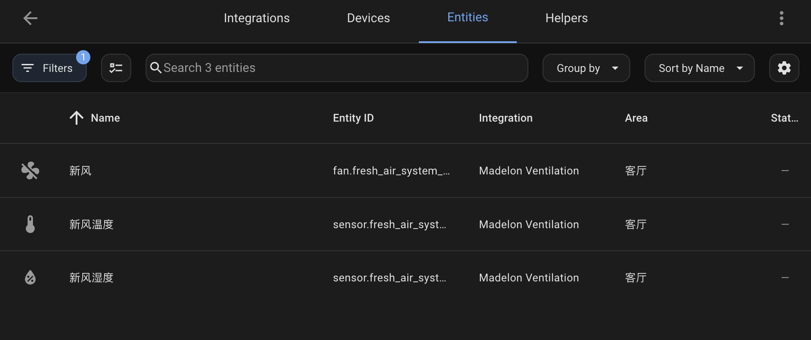

# Smart Madelon

迈迪龙新风接入Home Assistant解决方案

## Prerequisite
Home Assistant
HACS

## Datasheets


## Hardware Dependencies
RS485转WIFI模块 接在新风面板后面

Example:
汉枫的模块

### Usage
网线插设备网口，另外一头剪掉，里面有8根网线，标准网线的话，找到5 6 7 8这4根线（蓝白，绿，棕白，棕），然后7 8接电源正负极，5~36V稳定电源，7正8负，5 6接485的AB，5A6B

## HACS Custom Integration
### Features
- A Fan entity with speed control
- Two sensors for temperature and humidity
- Auto Mode switch and Bypass switch


### Setup guide

Add Custom Repo from HACS:


Put this repo url into config:


Download integration, then add integration:


Config your RS485 Module IP address, port and device id:


You will find 7 new entities:



### Example configuration.yaml section
```
homekit:
  - filter:
      include_entities:
        # 新风
        - fan.fresh_air_system_fan
        - switch.fresh_air_system_auto_mode
        - switch.fresh_air_system_bypass
    entity_config:
      switch.fresh_air_system_auto_mode:
        name: '新风自动模式'
      switch.fresh_air_system_bypass:
        name: '新风旁通模式'
```

## TODO list

- [x]Fan speed control with on/off
- [x]Mode selection
- [ ]Support timer feature
- [ ]Separate supply air and exhaust air speed control
- [ ]Add more stats as sensors and switches

