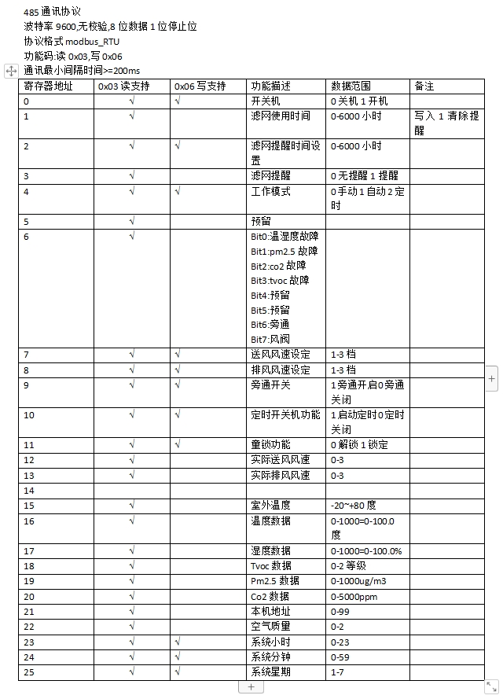

# Smart Madelon

迈迪龙新风接入Home Assistant解决方案

## Prerequisite
Home Assistant
MQTT Broker
NodeRed(Required for current solution)

## Datasheets


## Hardware Dependencies
RS485转WIFI模块 接在新风面板后面

Example:
汉枫的模块

### Usage
网线插设备网口，另外一头剪掉，里面有8根网线，标准网线的话，找到5 6 7 8这4根线（蓝白，绿，棕白，棕），然后7 8接电源正负极，5~36V稳定电源，7正8负，5 6接485的AB，5A6B

### Config
参考此贴：https://bbs.hassbian.com/thread-23091-1-1.html

## Current Solution

MQTT Device < -- > NodeRed Flow < -- > RS485 TCP server 

src code directory `mqtt_solution`

### Features
- 支持电源控制
- 支持风速控制 (暂时不支持送风排风单独控制）
- 支持读取新风机提供的温湿度数据
- 支持设置模式：
 - 手动
 - 自动
 - 定时（暂时不支持调整定时）
 - 手动/旁通开
 - 自动/旁通开
 - 定时/旁通开（暂时不支持调整定时）

### Usage
#### Config
Put ventilation.yaml into packages

```bash
mkdir -p packages
mv ventilation.yaml packages
```

add this line into configuration.yaml
```yaml
homeassistant:
  packages: !include_dir_named packages
```

#### Frontend card Example

```yaml
type: custom:stack-in-card
cards:
  - type: markdown
    content: |
      # 新风系统
    style: |
      ha-card {
        background: none;
        border: none;
        padding: 12px 0px 0px 0px;
      }
      h1 {
        font-size: 20px;
        font-weight: bold;
        margin: 0px 12px;
      }
  - type: custom:mushroom-fan-card
    entity: fan.ventilation_fan
    icon: mdi:hvac
    fill_container: true
    show_percentage_control: true
    show_oscillate_control: false
    layout: horizontal
  - type: grid
    columns: 2
    square: false
    cards:
      - type: custom:mushroom-template-card
        primary: 温度
        secondary: "{{ states('sensor.ventilation_temperature') }}°C"
        icon: mdi:thermometer
        fill_container: true
        layout: horizontal
        icon_color: orange
        style: |
          ha-card {
            --ha-card-height: 60px;
          }
      - type: custom:mushroom-template-card
        primary: 湿度
        secondary: "{{ states('sensor.ventilation_humidity') }}%"
        icon: mdi:water-percent
        fill_container: true
        layout: horizontal
        icon_color: blue
        style: |
          ha-card {
            --ha-card-height: 60px;
          }
  - type: custom:mushroom-select-card
    entity: input_select.ventilation_mode
    icon: mdi:fan-clock
    fill_container: true
style: |
  ha-card {
    background: var(--ha-card-background, var(--card-background-color, white));
    border-radius: var(--ha-card-border-radius, 12px);
    padding: 12px;
  }
```

## TODO list

- [ ]Separate supply air and exhaust air speed control
- [ ]Support timer feature
- [ ]Add more stats as sensors and switches
- [ ]Home Assistant Custom Integration

